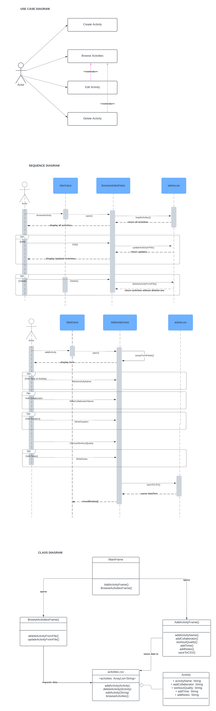

# OOP Final Project

# Project Description
This project uses Eclipse WindowsBuilder to implement a fitness tracker. Using the program, users are able to document their activities by adding the activity name, duration, collaborators, workout quality, and notes to a viewable list.

# Project Specifications

# Contributors
- Leeya Howley
- Janet Pan

